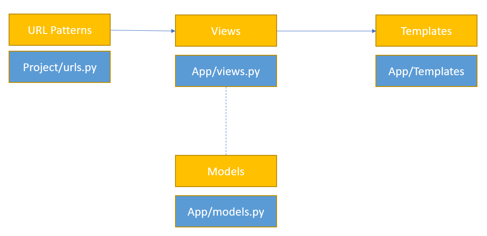

# These are my Django Notes

These are notes from the LinkIn Learning course "[Learning Django]()" by Caleb Smith.

[Install Python](https://www.python.org/downloads/) 3.9.6
Install django pip install --user django==3.0.3 best installed as admin

Create new project
1. navigate to project directory in terminal
2.  `django-admin startproject <projectname>`

Creates a folder called projectname which contains

  - manage.py - scripts used to manage the project
  - projectname/__init__.py - dunder init
  - projectname/asgi.py - hooks for web servers such as apache
  - *projectname/settings.py - configures Django*
  - *projectname/urls.py  - routes requests based on URL*
  - projectname/wsgi.py - hooks for web servers such as apache

## Running for first time

- Navigate to project directory, check in correct place should be same level as manage.py
- type `python manage.py runserver`
- Should see the server running at it's portnumber : "Starting development server at http://127.0.0.1:8000/"
- Should be able to browse to that site and wee a welcome message.  Also note generation of db.sqlite3 file.

## Django App Creation

- Component within a Django project.
- A folder within the project containing python files.
- Each app fulfils a single purpose.

1. Navigate to project folder
2. Type `python manage.py startapp <appname>`
    Creates a set of files in folder "appname":
    - admin.py - *admin to see and edit data for this app*
    - apps.py - *settings for this app*
    - models.py - *data layer for this app*
    - tests.py - *used to write unit tests for this app*
    - urls.py - *routing for app*
    - views.py - *logic to handle requests and define HTTP responses*
    - migrations/ - *data files for changing db schema*
3. Add app to project
   1. Edit projectname/settings.py
   2. Add line to INSTALLED_APPS section `'appname',`

## Django Models

Django uses a Model View Controller [MVC](https://www.tutorialsteacher.com/mvc/mvc-architecture) model.


*URL Patterns* Web requests are processed here, patterns are used to see which view to send request to.

*Views* - This is the logic, essentially a set of python functions that take HTTP requests and return HTTP responses.

*Models* - Used by views to perform database queries as needed. A class that defines the underlying structure of a database table.

*Templates* - Sets of HTML and control structures to control the display.

### Django Fields

Class attributes in class inherited from models.Model - these translate to attributes in a database table. There are many field types:
- Textual data:
   - CharField - "this is a set of chars" requires a MAX length
   - TextField - "Very similar to a CharField" unbounded
   - EmailField - mymail.com
   - URLField - www.mywebsite.com
- Numerical data:
   - IntegerField - 1, 2, 3 ...
   - DecimalField - 0.5, 3.0 ...   
- Miscellaneous data:
   - BooleanField - true, false
   - DataTimeField - (2021,1,9,0,0)
- Relational data:
   - ForignKey - 1 (ID of record in another table)   
   - ManyToManyField - N/A

Full list of field types and options can be found in the [Django documentation](https://docs.djangoproject.com/en/3.2/ref/models/fields/)

## Implementing Models and Fields

1. Open project/models.py file
2. Add class to define fields for an object in this case Pet 

```python
    class Pet(models.Model):
        # Note choices here is a list of tuples which are data value and display value
        SEX_CHOICES = [('M', 'Male'), ('F', 'Female')]
        name = models.CharField(maxlength=100)
        submitter = models.CharField(maxlength=100)
        species = models.CharField(maxlength=30)
        breed = models.CharField(maxlength=30, blank=True)
        description = models.TextField()
        sex = models.CharField(maxlength=1, choices=SEX_CHOICES, blank=True)
        age = models.IntegerField()
        submission_date = models.TimeDateField()
```

3. And any other tables or classes we need for this app - here we have vaccines required by the adopted pets:

``` python
    class Vaccine(models.Model):
        name = models.CharField(maxlength=50)
```

4. Now define the relationship between the classes - we do this by adding an additional field in our classes.  Here we can add a M:N relationship between Pet and Vaccine `vaccinations = models.ManyToManyField('Vaccine', blank = True)` defined in Pet - note reference to vancine class in the argument list.
